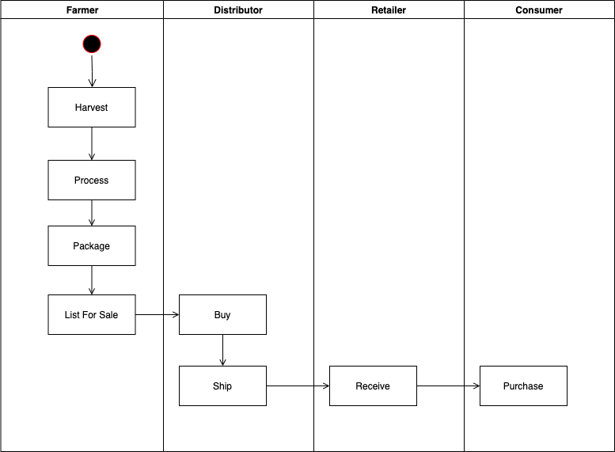
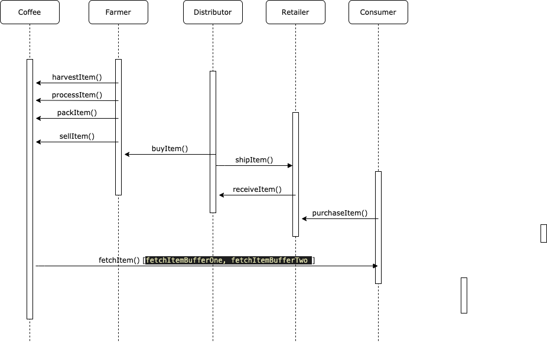
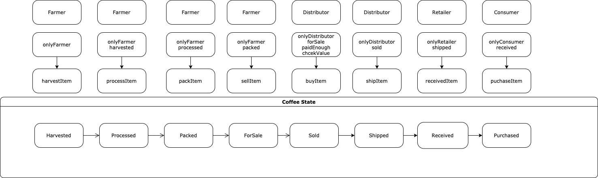
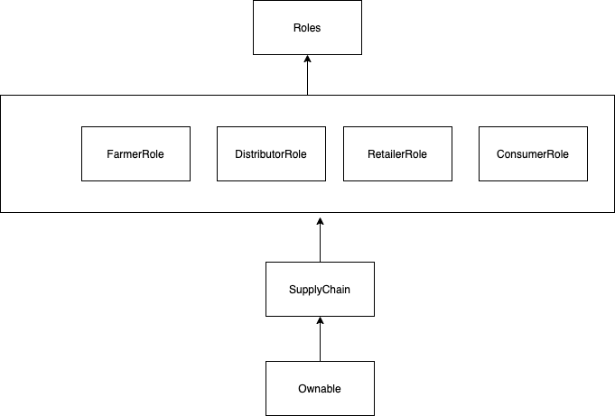

## Coffee Supply Chain Using Ethereum and Solidity 
#### UML 
##### Activity 

##### Sequence

##### State

##### Class

#### Libraries
- truffle: `v5.1.31`
- node: `v8.9.4`
- ganache-cli: `^6.10.0-beta.2`
- truffle-hdwallet-provider: `^1.0.17`
- web3-eth: `^1.2.9`
- web3: `1.2.1`
- truffle-assertions: `^0.9.2`
- solidity-version: `0.6.2`

#### Contract Details 
- contract address: `0xaa45250773C34e43CB17cC73Ab3AC6A822462B43`
- transaction hash: `0xa30e738186bce289b54619091aec22b6eb364507ca547622484f7dee95e9aa0a` 
- Etherscan: https://rinkeby.etherscan.io/address/0xaa45250773c34e43cb17cc73ab3ac6a822462b43

#### Running the project 
1. install npm packages `npm install`
2. run `npm run dev` which will start a local webserver at `localhost:8080`  
3. If you would like to run the blockchain locally run `truffle migrate` and configure metamask client to connect to the local blockchain